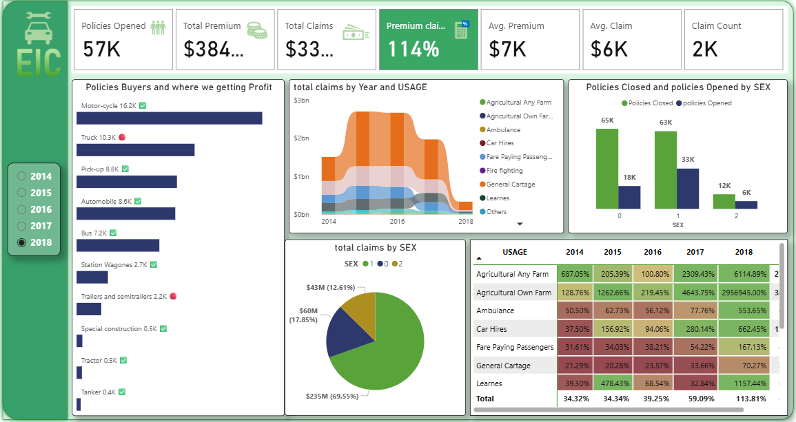

# 🚗 Motor Insurance Claims Dashboard (2014–2018)

This Power BI dashboard visualizes key metrics from motor insurance policy and claim data between 2014 and 2018. It analyzes the profitability of vehicle types, demographic claim trends, and the overall claim-to-premium performance.

---

## 📊 Dashboard Insights

- **Policies Opened:** 57,000+
- **Total Premium Collected:** $384M+
- **Total Claims:** $33M+
- **Premium-to-Claim Ratio:** 114%
- **Top Profitable Vehicle Types:** Motor-cycles, Pick-ups, Automobiles
- **Claims by Gender:** Majority from one gender group (detailed in pie chart)
- **Claims by Usage & Year:** Includes agricultural, ambulance, car hires, and more

---

## 🧰 Tools & Technologies Used

- **Power BI Desktop**
- **DAX** for calculations and dynamic visuals
- **Slicers & Filters** for multi-year, multi-category analysis

---

## 📷 Dashboard Preview

---

## 📁 Files Included

- `Motor Insurance.pbix` – Main Power BI report
- `Motor-Dashboard.png` – Dashboard preview
- `README.md` – This documentation

---

## 💼 Use Case

This dashboard is useful for:

- **Insurance Analysts**: Identify high-risk and low-profit segments
- **Executives**: Understand business performance by vehicle type and customer demographics
- **Policy Makers**: Spot gender or regional claim disparities over time

---

