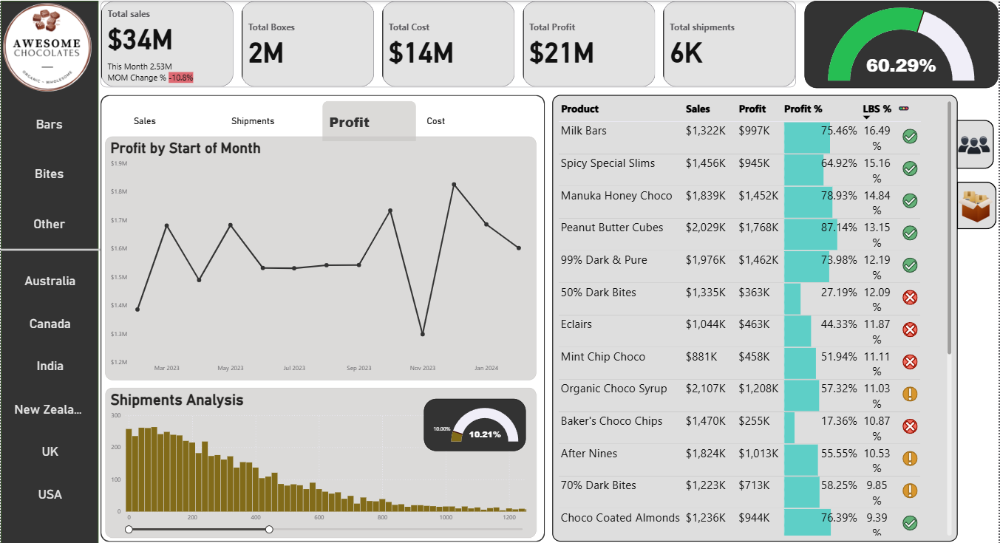

# 🍫Chocolates Sales Dashboard

This Power BI dashboard provides a comprehensive overview of the global sales performance of Awesome Chocolates. It captures key metrics such as revenue, profit, shipments, and product-level analysis across multiple countries.

---

## 📊 Dashboard Highlights

- **Total Sales:** $34M  
- **Total Profit:** $21M  
- **Total Boxes Sold:** 2M  
- **Total Shipments:** 6K  
- **Month-on-Month Change:** 📉 -10.8%  
- **Profit Margin:** 60.29%

### 📦 Top Performing Products
- **Peanut Butter Cubes:** $2.03M Sales, 87.14% Profit Margin  
- **Manuka Honey Choco:** $1.84M Sales, 78.93% Profit Margin  
- **99% Dark & Pure:** $1.98M Sales, 73.98% Profit Margin  

### 🚫 Underperformers
- **50% Dark Bites & Baker’s Choco Chips** – Low profitability and shipment efficiency  
- Visual alerts (✅/❌/⚠️) highlight product performance vs targets

---

## 🌍 Country-wise Filters

Includes slicers for:
- **Product Type:** Bars, Bites, Other  
- **Countries:** Australia, Canada, India, NZ, UK, USA

---

## 🧰 Tools & Technologies Used

- **Power BI Desktop**
- **DAX** for custom measures and KPIs
- **Card visuals**, **bar charts**, **scatter plots**, and **custom gauges**

---

## 📷 Dashboard Preview

---

## 📁 Files Included

- `Sales-Dashboard.pbix` – Power BI file with visualizations
- `Sales-Dashboard.png` – Dashboard snapshot
- `README.md` – Project documentation

---

## ✅ Use Case

Designed for:
- **Sales Executives**: To evaluate product-level profitability
- **Marketing Teams**: To identify best-selling products and low performers
- **Operations**: To assess shipment trends and logistics efficiency

---

