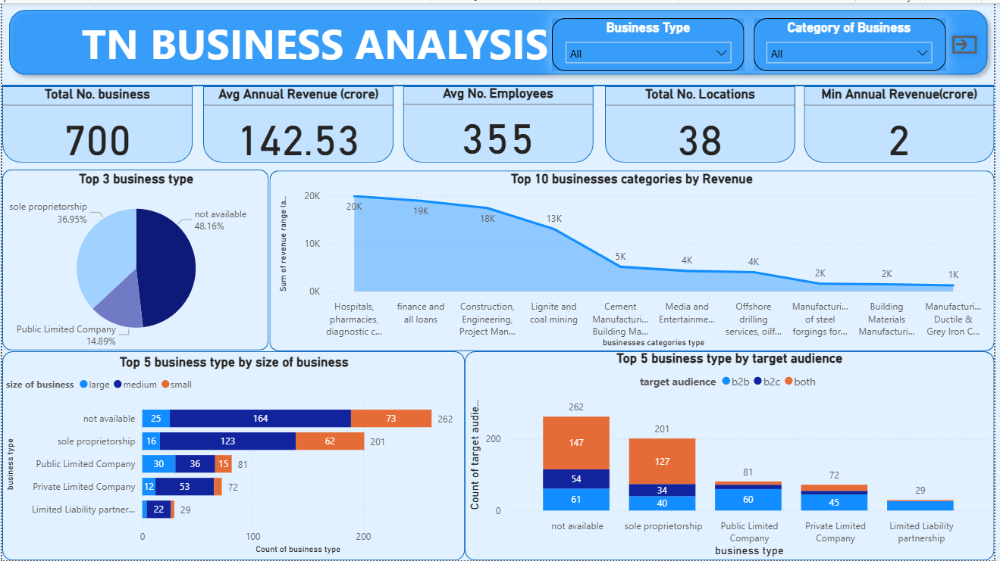
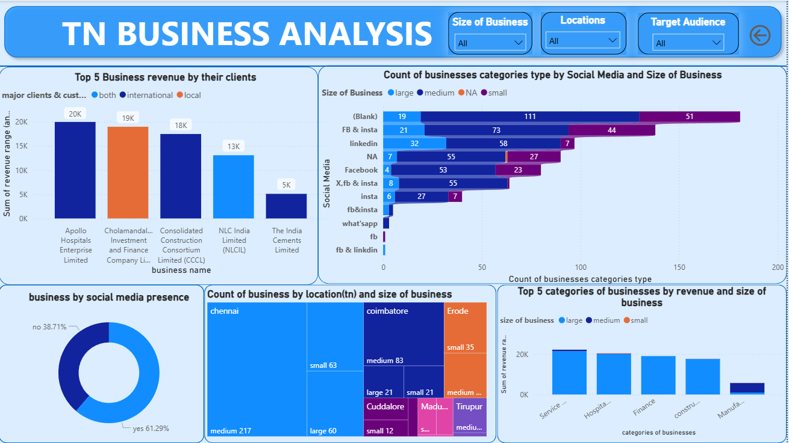

# 📊 TN Business Analysis Dashboard

This Power BI dashboard provides insights into business trends across Tamil Nadu. It helps analyze various aspects such as revenue, employee count, business type distribution, and target audience across different sectors.

---

## 📌 Key Features

- Total businesses analyzed: **700**
- Average annual revenue and employee statistics
- Revenue-wise ranking of top business categories
- Comparison of business types by:
  - Size (small/medium/large)
  - Target audience (B2B, B2C, both)

---

## 🧰 Tools & Technologies

- Power BI Desktop
- DAX for calculated metrics
- Slicers for dynamic filtering (Business Type & Category)

---

## 📷 Dashboard Preview
- Page 1

- Page 2

---

## 📁 Files Included

- `TN Business Analysis.pbix` – Power BI file
- `TN-Business-Dashboard.png` – Dashboard snapshot
- `README.md` – Project documentation

---

## 📝 Insights

- Majority of businesses are sole proprietorships or unspecified
- Healthcare, finance, and construction lead in revenue
- Public & private limited companies have varied audience reach (B2B/B2C)

---

## 💡 Use Case

This dashboard can help:
- Policy makers understand economic distribution
- Investors identify high-revenue business categories
- Business owners benchmark their operations

---

