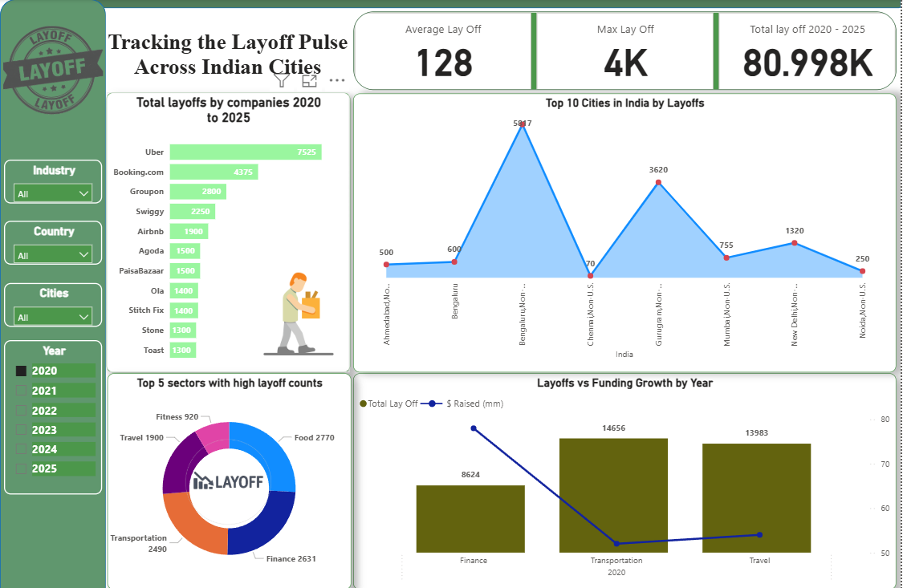

# 🔍 Layoff Trends Dashboard: India (2020–2025)

This Power BI dashboard provides a visual overview of employee layoffs across major cities and companies in India from 2020 to 2025. It helps track trends, identify high-impact sectors, and analyze the relationship between layoffs and startup funding.

---

## 📊 Key Highlights

- **Total Layoffs (2020–2025):** 753,669+
- **Top Companies with Most Layoffs:** Intel, Microsoft, Amazon, Meta
- **Cities Most Affected:** Bengaluru, Chennai, Gurugram, Mumbai
- **Top Sectors by Layoffs:** Education, Finance, Food, Retail, Transportation
- **Year-wise comparison of layoffs vs. funding growth**

---

## 🧰 Tools & Technologies

- **Power BI Desktop**
- **DAX Measures** for dynamic calculations
- **Custom Visuals & Filters** for interactivity

---

## 📷 Dashboard Preview

---

## 📁 Project Files

- `Layoff Dashboard.pbix` – Power BI dashboard file
- `Layoff-Dashboard.png` – Image preview
- `README.md` – Project documentation

---

## 💡 Use Case

This dashboard can assist:

- **HR professionals & Analysts**: Understand sector-wise trends
- **Investors**: Track how funding correlates with layoffs
- **Jobseekers & Policy Makers**: Identify industry health and risks

---

